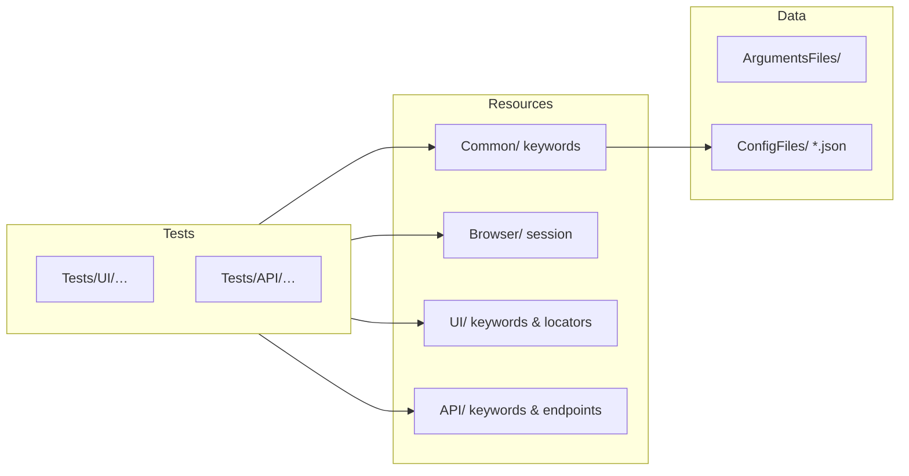

<div align="center">

# Automation Portfolio

**End-to-end and API test automation with [Robot Framework](https://robotframework.org/), [Browser](https://marketsquare.github.io/robotframework-browser/Browser.html), and [Requests](https://marketsquare.github.io/robotframework-requests/doc/RequestsLibrary.html).**

[](https://www.python.org/)
[](https://robotframework.org/)
[](https://python-poetry.org/)
[](LICENSE)
[](#cicd-github-actions)

*Portfolio-style suite targeting [Automation Exercise](https://www.automationexercise.com/) for UI flows and its public REST API.*

</div>

---

## Table of contents

1. [Overview](#overview)
2. [Tech stack](#tech-stack)
3. [How the repository is organized](#how-the-repository-is-organized)
4. [What gets tested](#what-gets-tested)
5. [Prerequisites](#prerequisites)
6. [Local setup](#local-setup)
7. [Configuration](#configuration)
8. [Running tests locally](#running-tests-locally)
9. [Running with Docker](#running-with-docker)
10. [CI/CD (GitHub Actions)](#cicd-github-actions)
11. [Test results & artifacts](#test-results--artifacts)
12. [Tags & selective runs](#tags--selective-runs)
13. [Design patterns](#design-patterns)
14. [Troubleshooting](#troubleshooting)
15. [License & author](#license--author)

---

## Overview

This repository showcases a **maintainable** automation layout:

- **UI tests** driven by Robot Framework Browser (Playwright) with shared browser bootstrapping and reusable UI keywords/page-style locators.
- **API smoke tests** using the Requests library against the same product’s REST API (`base_url` in config).
- **Environment-specific variables** loaded from JSON (`Data/ConfigFiles/`) plus optional Robot argument files (`Data/ArgumentsFiles/`).
- **Reproducible CI** via Docker and GitHub Actions, with artifacts for logs and HTML reports.

The demo target is intentionally a **public practice site**. Treat any credentials or tokens as **secrets** when you fork or reuse this pattern.

---

## Tech stack

| Layer | Choice |
|--------|--------|
| Language | Python **≥ 3.12** |
| Test runner | [Robot Framework](https://robotframework.org/) |
| UI automation | [robotframework-browser](https://marketsquare.github.io/robotframework-browser/Browser.html) (Playwright) |
| HTTP client | `requests` (via Robot’s Requests library patterns in suites) |
| Dependency / env manager | [Poetry](https://python-poetry.org/) (`pyproject.toml`, `poetry.lock`) |
| Containers | Dockerfile based on **`ghcr.io/marketsquare/robotframework-browser/rfbrowser-stable`** |
| CI | GitHub Actions (`.github/workflows/main.yml`) |

Core dependencies are declared in `pyproject.toml` (pinned versions in `poetry.lock`). Resource files also reference **`JsonLibrary`** / **`JSONLibrary`** helpers; if you see import errors for those libraries locally, install the matching PyPI packages (see [Troubleshooting](#troubleshooting)).

---

## How the repository is organized



**Directory map**

| Path | Purpose |
|------|---------|
| `Tests/UI/` | UI suites (e.g. login/signup flows). Suite tag: `smokeui`. |
| `Tests/API/` | API suites. Suite tag: `smokeapi`. |
| `Resources/Common/` | Shared keywords: configuration loading, helpers (random email/user data). |
| `Resources/Browser/` | Browser lifecycle: YAML defaults, Playwright Browser library setup. |
| `Resources/UI/` | UI keywords and locator variables (`*_kw.robot`, `*_po.robot`). |
| `Resources/API/` | API keywords and endpoint path variables (`*_kw.robot`, `*_po.robot`). |
| `Data/ConfigFiles/` | JSON variable files consumed with Robot’s `-V` (nested `LOGIN_CONFIG`). |
| `Data/ArgumentsFiles/` | Aggregate Robot CLI options (`-A` argument file). |
| `Dockerfile` | Image with Poetry installs, Playwright/`rfbrowser init`, Robot entrypoint. |
| `.github/workflows/main.yml` | CI: build image, run `Tests/` in container, upload `Results/`. |

---

## What gets tested

### UI (`Tests/UI/01_Login_Signup/login.robot`)

| Scenario | Tags | Focus |
|----------|------|--------|
| Full registration flow + cleanup | `login`, `registration` | Happy path signup, address steps, delete account |
| Registration with existing email | `login`, `registration` | Duplicate-email validation |
| Login with valid credentials | `smoke`, `login` | Login + logout |
| Login with invalid password | `smoke`, `login` | Negative path |

**Suite tag:** `smokeui` (used by CI for UI selection).

The application URL and user identity fields are taken from configuration at runtime (see [Configuration](#configuration)), not from the placeholder values in the suite header.

### API (`Tests/API/01_SmokeApi.robot`)

| Scenario | Focus |
|----------|--------|
| GET products list | Status 200, body contains expected product text |
| POST search product | Form-style POST with search term |
| GET brands list | Status 200, body contains `brands` |
| POST verify login | Valid credentials → expected success message |
| POST create account | Random user payload → user created |
| DELETE account | Cleanup using created user credentials |

**Suite tag:** `smokeapi`. Endpoints are defined in `Resources/API/SmokeAPI_po.robot` (paths under `${BASE_URL}` from config).

---

## Prerequisites

On your workstation you need:

1. **Python 3.12+** ([python.org](https://www.python.org/downloads/))  
2. **Poetry** ([installation](https://python-poetry.org/docs/#installation))  
3. **Git** (to clone this repository)

For Browser library locally you also need the **browser binaries** installed by `rfbrowser init` (downloads Playwright browsers for your OS).

Docker-based runs (CI or local) handle Playwright initialization inside the image.

---

## Local setup

From the repository root (`robot-automation-project/`):

### 1. Clone and enter the project

```bash
git clone <your-fork-or-remote-url>.git
cd robot-automation-project
```

### 2. Install dependencies with Poetry

```bash
poetry install
```

This installs Robot Framework, `robotframework-browser`, `requests`, and locked transitive dependencies (`poetry.lock`).

### 3. Initialize Playwright for Browser library

```bash
poetry run rfbrowser init
```

Run this again after upgrading `robotframework-browser` versions.

### 4. Verify Robot is available

```bash
poetry run robot --version
```

---

## Configuration

### Environment JSON (`Data/ConfigFiles/`)

Tests load a variable file **with Robot’s `-V`**. Example structure (see `Data/ConfigFiles/uat.json`):

| Variable (nested under `LOGIN_CONFIG`) | Typical use |
|---------------------------------------|-------------|
| `url` | Web application base URL opened in Browser |
| `base_url` | REST API prefix (often includes trailing slash or path segment per your API conventions) |
| `username` / `password` | Login-capable accounts for UI/API |
| `name` | Display name used in registration scenarios |

To add staging or production, create e.g. `staging.json` and pass `-V Data/ConfigFiles/staging.json`.

> **Security:** Prefer environment-specific JSON that is **not committed**, or inject secrets via CI variables and generate a file in the workflow. Never commit real production passwords.

### Browser defaults (`Resources/Browser/BrowserConfiguration.yaml`)

Controls Playwright engine, headless mode, timeouts, window resolution presets (`HD`, `FHD`, `QUAD_HD`, `MAX`), incognito vs persistent strategy, and optional Chrome args. You can override many of these from the command line with `-v NAME:value`.

### Argument file (`Data/ArgumentsFiles/Arguments.robot`)

This file is a **Robot argument file**: use it to centralize `-v`, `-V`, output paths, and default test paths.

```bash
poetry run robot -A Data/ArgumentsFiles/Arguments.robot
```

Edit the bottom of that file to point at `Tests/UI/...`, `Tests/API/...`, or the whole `Tests/` tree. The committed defaults may target a **single suite**; change the path to match what you want to run.

---

## Running tests locally

All examples assume you run from the **repository root**.

### Run the whole `Tests/` tree with UAT variables

```bash
poetry run robot -V Data/ConfigFiles/uat.json Tests/
```

### Headless Chrome-style variables (common for servers)

```bash
poetry run robot -V Data/ConfigFiles/uat.json -v WEB_BROWSER:chromium -v BROWSER_IS_HEADLESS:True Tests/
```

### Use the bundled argument file

```bash
poetry run robot -A Data/ArgumentsFiles/Arguments.robot
```

Adjust `Arguments.robot` first if you want UI instead of API (or vice versa).

### Outputs

By default, local runs often write under `results/` or `Results/` depending on flags. Robot produces:

- **`report.html`** – summary  
- **`log.html`** – step-level log  
- **`output.xml`** – machine-readable results  

The repository `.gitignore` excludes common Robot output patterns so accidental commits of large HTML/XML are avoided.

---

## Running with Docker

The `Dockerfile` builds on the official **robotframework-browser** stable image, runs `poetry install`, copies the project, runs `poetry run rfbrowser init`, and sets an entrypoint that executes `poetry run robot "$@"`.

### Build

```bash
docker build -t robot-framework-tests:latest .
```

### Run (mount a host folder for reports)

**Linux / macOS / Git Bash:**

```bash
mkdir -p Results
docker run --rm -v "$(pwd)/Results:/app/Results" robot-framework-tests:latest \
  --outputdir Results \
  -V Data/ConfigFiles/uat.json \
  Tests/
```

**PowerShell (Windows):**

```powershell
New-Item -ItemType Directory -Force -Path Results | Out-Null
docker run --rm -v "${PWD}/Results:/app/Results" robot-framework-tests:latest `
  --outputdir Results `
  -V Data/ConfigFiles/uat.json `
  Tests/
```

After the run, open `Results/report.html` and `Results/log.html` in a browser.

---

## CI/CD (GitHub Actions)

Workflow file: [`.github/workflows/main.yml`](.github/workflows/main.yml).

| Trigger | Behavior |
|---------|----------|
| **Push** to `main` or `master` | Full pipeline |
| **Pull request** into `main` or `master` | Full pipeline |
| **workflow_dispatch** (manual) | Choose test group from dropdown |

### What the job does

1. Checks out the repository.  
2. Sets up Docker Buildx.  
3. **Builds** the local `Dockerfile` (`load: true`, no push to a registry).  
4. Creates a host `Results/` directory.  
5. **Runs** Robot inside the container with:

   - `--outputdir Results`  
   - `-V Data/ConfigFiles/uat.json`  
   - `--variable BROWSER:chrome`  
   - `--variable BROWSER_IS_HEADLESS:true`  
   - Target: `Tests/`  
   - Optional `--include <tag>` when a manual group is selected (see below).  

6. **Uploads** the `Results/` folder as a workflow artifact (retained 30 days), even if some tests fail (`if: always()`).

### Manual run: pick `all`, `smokeapi`, or `smokeui`

In GitHub: **Actions → Robot Framework Tests → Run workflow**.

| Input value | Effective Robot filter |
|-------------|-------------------------|
| `all` | No `--include` (entire suite under `Tests/`) |
| `smokeapi` | `--include smokeapi` |
| `smokeui` | `--include smokeui` |

### Viewing CI results

Open the workflow run → **Artifacts** → download `robot-results-run-<number>` → inspect `report.html` / `log.html`.

---

## Test results & artifacts

| Location | When |
|----------|------|
| Local `results/` or `Results/` | Typical local `--outputdir` |
| GitHub Actions artifact | Every workflow run (success or failure) |

---

## Tags & selective runs

| Tag | Used for |
|-----|----------|
| `smokeui` | Suite-level tag on UI login suite; CI “UI only” |
| `smokeapi` | Suite-level tag on API suite; per-test tag on API cases; CI “API only” |
| `smoke`, `login`, `registration` | Finer-grained UI scenarios |

Examples:

```bash
poetry run robot -V Data/ConfigFiles/uat.json --include smokeapi Tests/
poetry run robot -V Data/ConfigFiles/uat.json --include smokeui Tests/
```

Combine with `--exclude` or multiple `--include` patterns as needed.

---

## Design patterns

- **Layered resources:** Tests stay thin; reusable logic lives under `Resources/`.  
- **Page-object style variables:** Locators and paths split into `*_po.robot` files; interaction keywords in `*_kw.robot`.  
- **Shared setup:** `Setup Automation UI` / `Setup Automation API` in `Resources/Common/common_kw.robot` load JSON-backed variables and (for UI) open a configured browser context via `ManageBrowser.robot`.  
- **Single Docker image** for dev parity and CI: same Poetry lock and `rfbrowser init` as production-like runs.

---

## Troubleshooting

| Symptom | What to try |
|---------|-------------|
| `Browser` / Playwright errors after upgrade | Run `poetry run rfbrowser init` again. |
| Import error for `JsonLibrary` / `JSONLibrary` | Install the corresponding Robot JSON helper package with Poetry/pip and ensure it is on `PYTHONPATH`, or add it to `pyproject.toml` if you adopt it officially. |
| Wrong environment | Confirm `-V Data/ConfigFiles/<env>.json` and that `LOGIN_CONFIG` keys match what keywords expect. |
| Docker permission errors on `Results/` | Ensure the mounted directory exists and is writable; on Linux, check ownership vs container user `pwuser`. |
| Flaky UI on slow agents | Increase `BROWSER_TIMEOUT` in YAML or via `-v BROWSER_TIMEOUT:60`. |

---

## License & author

- **License:** [MIT](LICENSE)  
- **Author:** Marcelo Pinheiro (see `pyproject.toml`)

---

<div align="center">

**Happy testing**

</div>
